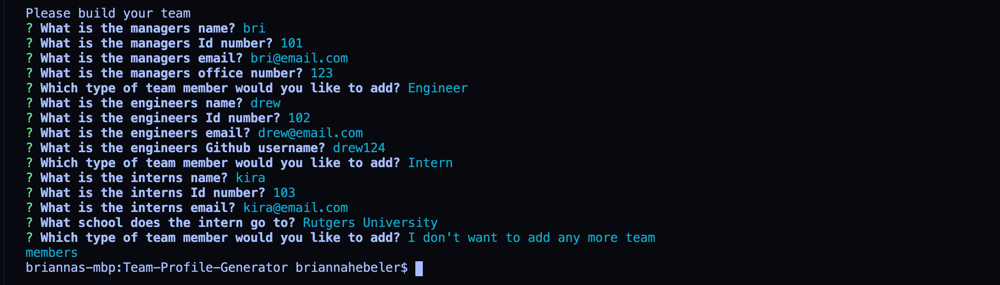

# Team Profile Generator

## Description

A Node CLI that generates profiles for each member of a software engineering team. This application accepts user information to generate an HTML webpage that displays a team roster of summaries for each team member in order for the user to quickly access emails and GitHub profiles for all team members.

## Table of Contents  
* [Installation](#installation)
* [Usage](#usage)
* [Contributing](#contributing)
* [Tests](#tests)
* [Questions](#questions)

## Installation
This generator requires the user to install node.js and then the inquirer dependency.

## Usage
Run the code through the terminal. Use the command "node app.js" to prompt the questions used to generate the team profile HTML.

Checkout video of application here: https://youtu.be/N9DYb1cL9bA

## Contributing
To contribute to this project you can fork this GitHub repository.

## Tests
To run tests for this application you can run the command "npm test" in your terminal. 

## Questions
If you have any additional questions about this application you can reach out to me at briannahebeler@gmail.com.
You can check out some of my other projects at briannahebeler (https://github.com/briannahebeler).
